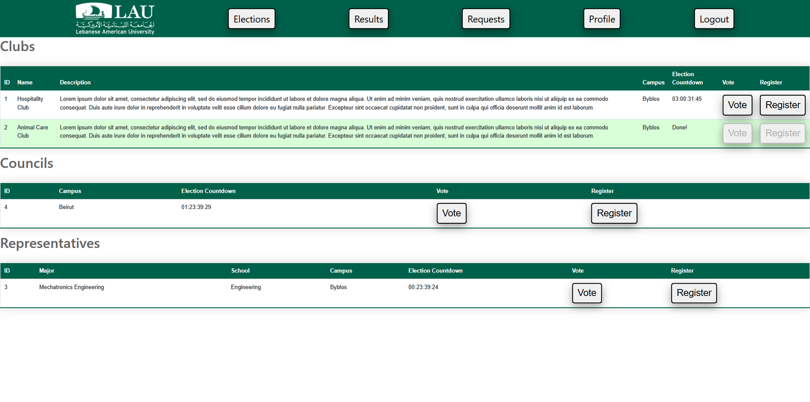
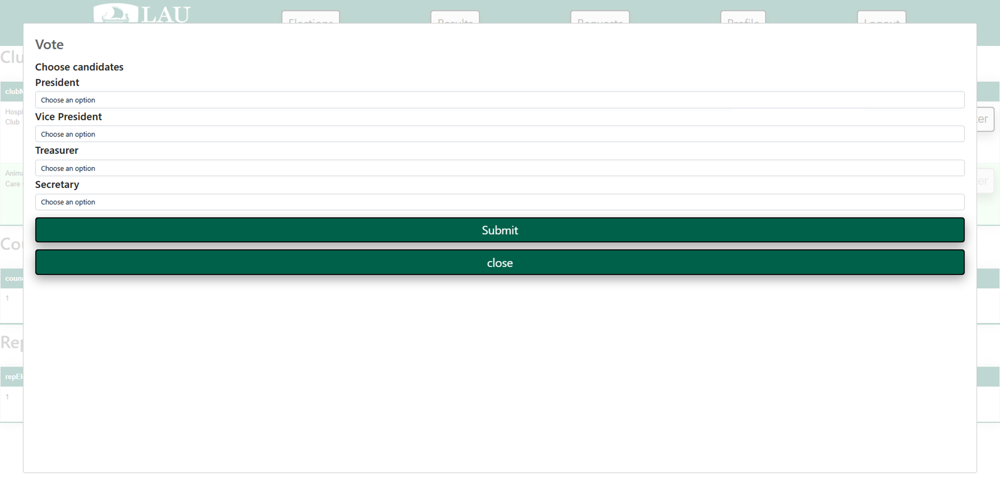
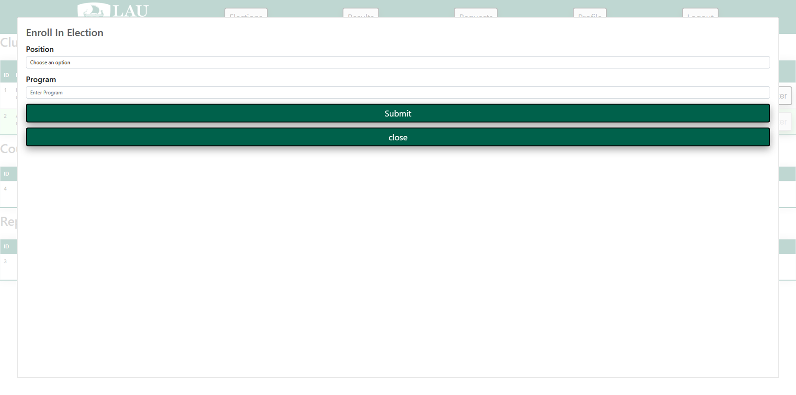
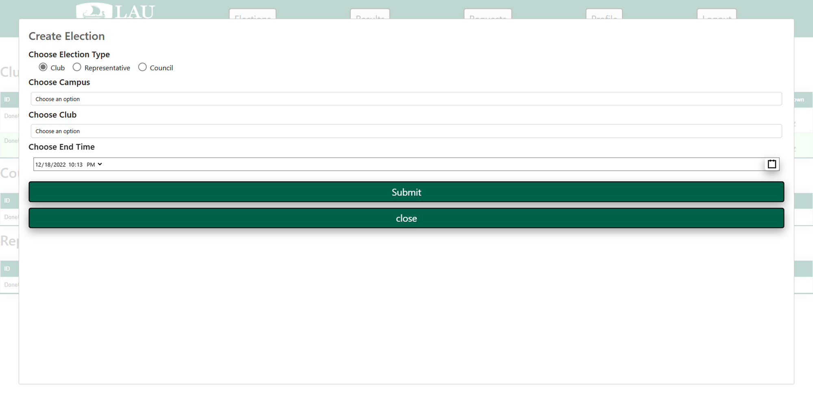
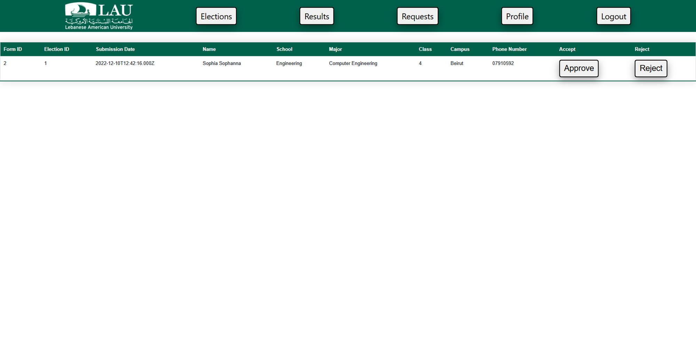
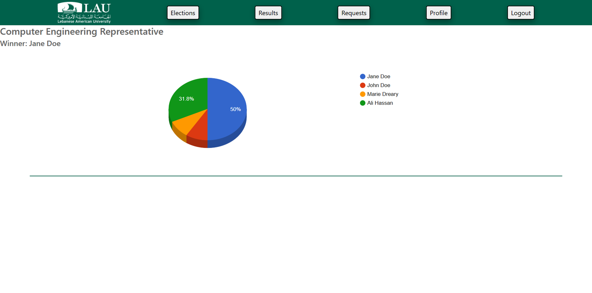

# Student Election Platform

## Description

This website allows LAU students to vote, and run for club positions, council members, and major representatives. All
this with the supervision of admins who can create elections, accept/reject candidates' forms, and monitor the results.

## Features

### Elections

* View available elections
* Vote in elections
* Register in elections
* Create elections

#### Vote

#### Register

#### Create

## Requests

* View candidacy requests
* Approve/reject requests

## Results

* View results
* View vote percentages

